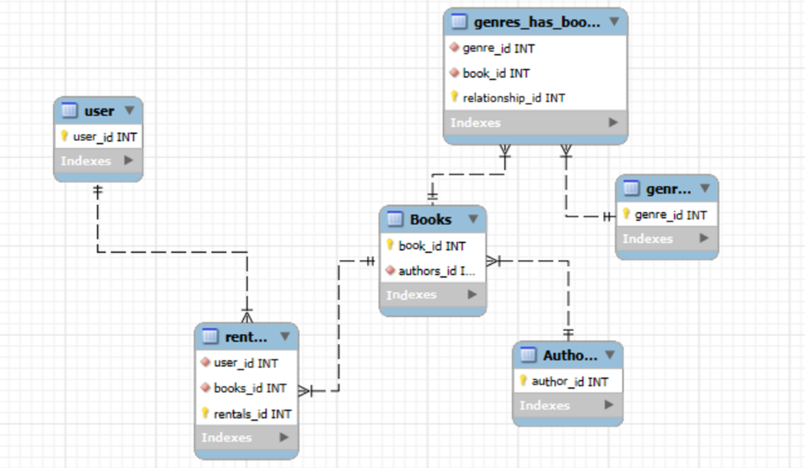

# Digital Library - A SQL Database Project 
  - **An academic project at Oregon State University, CS340 - Databases**
    
**A collaborative web application for managing digital library content including books, authors, and genres, built with Node.js and MariaDB**

## Overview

This project demonstrates robust backend architecture using normalized relational database design, stored procedures, and a structured approach to data operations. Built as part of a collaborative team project at Oregon State University (Apr 2025 - Jun 2025), the Digital Library showcases production-ready database-first development principles and full CRUD functionality through a clean, maintainable architecture.

The application manages a comprehensive digital library system with complex relationships between books, authors, and genres, implementing industry best practices for database design and secure data handling.

The MariaDB database was hosted by Oregon State University and accessed through SSH. Thus, following exact cloning and reproduction steps are not valid - you can view a project demo here: https://www.youtube.com/watch?v=klA89MbyOjg

## Key Features

### Entity Relationship Diagram

### Database Schema
The database follows a fully normalized Third Normal Form design:

### Database Design & Architecture
- **Third Normal Form (3NF) Schema**: Fully normalized relational database design eliminates redundancy and ensures data integrity
- **Many-to-Many Relationships**: Sophisticated intersection tables model complex relationships between books and genres
- **Stored Procedures**: All Create, Update, and Delete (CUD) operations encapsulated in stored procedures for improved maintainability and performance
- **Data Integrity**: Comprehensive foreign key constraints and validation rules ensure consistent data state

### Backend Development
- **Node.js Backend**: Robust server-side architecture interfacing with MariaDB through parameterized queries
- **SQL Injection Protection**: Secure database interactions using parameterized queries and prepared statements
- **Modular Route Structure**: Scalable entity operations architecture (Books, Authors, Genres) designed for future expansion
- **Error Handling**: Comprehensive error management and logging throughout the application

### Security & Performance
- **Parameterized Queries**: Protection against SQL injection attacks
- **Connection Pooling**: Efficient database connection management
- **Input Validation**: Server-side validation for all user inputs
- **Transaction Management**: ACID compliance for critical operations

## Technical Implementation

### Stored Procedures
All data manipulation operations utilize stored procedures with comprehensive error handling:
- Input validation and existence checks
- Comprehensive error messages
- Transaction support where appropriate (books, relationships)
- Rollback capabilities for data integrity
- Unique constraint validation (users, genres, relationships)

#### Rental Management
- `add_rental(user_id, book_id, date, expiration_date)` - Create new rental with validation
- `update_rental(rental_id, user_id, book_id, date, expiration_date)` - Update existing rental
- `delete_rental(rental_id)` - Delete rental with existence check

#### Book Management  
- `add_book(title, author_id, publication_date, description, total_qty)` - Create new book with transaction support
- `update_book(book_id, title, author_id, publication_date, description, total_qty)` - Update existing book
- `delete_book(book_id)` - Delete book with existence check

#### Author Management
- `add_author(name, bio)` - Create new author
- `update_author(author_id, name, bio)` - Update existing author  
- `delete_author(author_id)` - Delete author with existence check

#### Genre Management
- `add_genre(title)` - Create new genre with uniqueness validation
- `update_genre(genre_id, title)` - Update existing genre with uniqueness check
- `delete_genre(genre_id)` - Delete genre with existence check

#### User Management
- `add_user(username, password, email)` - Create new user with unique username/email validation
- `update_user(user_id, username, password, email)` - Update user with uniqueness checks
- `delete_user(user_id)` - Delete user with existence check

#### Relationship Management (Book-Genre Junction)
- `add_relationship(genre_id, book_id)` - Create book-genre relationship with duplicate prevention
- `update_relationship(relationship_id, genre_id, book_id)` - Update relationship with validation
- `delete_relationship(relationship_id)` - Delete relationship with existence check

## API Endpoints

### Books
- `GET /api/books` - Retrieve all books
- `POST /api/books` - Create new book
- `PUT /api/books/:id` - Update existing book
- `DELETE /api/books/:id` - Delete book

### Authors
- `GET /api/authors` - Retrieve all authors
- `POST /api/authors` - Create new author
- `PUT /api/authors/:id` - Update existing author
- `DELETE /api/authors/:id` - Delete author

### Genres
- `GET /api/genres` - Retrieve all genres (ordered by genre_id)
- `POST /api/genres` - Create new genre
- `PUT /api/genres/:id` - Update existing genre
- `DELETE /api/genres/:id` - Delete genre

### Users
- `GET /api/users` - Retrieve all users
- `POST /api/users` - Create new user
- `PUT /api/users/:id` - Update existing user
- `DELETE /api/users/:id` - Delete user

### Rentals
- `GET /api/rentals` - Retrieve all rentals
- `POST /api/rentals` - Create new rental
- `PUT /api/rentals/:id` - Update existing rental
- `DELETE /api/rentals/:id` - Delete rental

### Book-Genre Relationships
- `GET /api/relationships` - Retrieve all book-genre relationships
- `POST /api/relationships` - Create new book-genre relationship
- `PUT /api/relationships/:id` - Update existing relationship
- `DELETE /api/relationships/:id` - Delete relationship

### Database Management
- `POST /api/reset` - Reset database to initial state with sample data

### Debug (Development)
- `GET /api/debug/connection` - Get database connection status and record counts

## Development Approach

This project emphasizes **database-first development** with the following principles:

1. **Normalized Design**: Database schema designed to Third Normal Form before application development
2. **Stored Procedure Logic**: Business logic encapsulated in database stored procedures
3. **Security First**: All database interactions use parameterized queries
4. **Modular Architecture**: Clean separation of concerns with scalable route organization
5. **Team Collaboration**: Git-based workflow with feature branches and code reviews

## Skills Demonstrated

- **Database Design**: Third Normal Form normalization, relationship modeling
- **SQL Proficiency**: Complex queries, stored procedures, transaction management
- **Backend Development**: Node.js, RESTful API design, middleware implementation
- **Security**: SQL injection prevention, input validation, secure coding practices
- **Team Collaboration**: Git workflow, code reviews, collaborative problem solving
- **Technical Leadership**: Architecture decisions, requirements analysis
